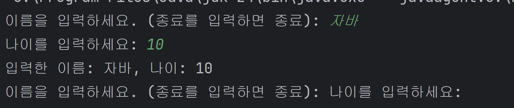

# 강의 내용 정리

## 스코프 Scope

### 스코프

---

- 변수의 접근 가능한 범위
- 블록 `{}` 을 기준으로 결정됨

### 스코프를 고려한 반복문

---

- **while**

```java
int i = 1;
while(i<=10){
	// 코드
	i++;
}
```

→ 변수 `i` 는 `while`뿐만 아니라 `main` 전체에서 사용 가능

- **for**

```java

for(int i=1; i<=10; i++){
		// 코드
}

```

→ 변수 `i` 는 `for`문 안에서만 사용 가능

⇒ `for`문이 **메모리 효율**, **유지보수**에 더 유리함

## 형변환 Casting

### 묵시적 형변환

---

- 숫자 표현 범위 `int` < `long` < `double`
- 작은 범위 → 큰 범위 : 자동 형변환

```java
int intValue = 100;
long longValue;

longValue = intValue; // 자동 형변환
```

### 명시적 형변환

---

- 큰 범위 → 작은 범위

```java
double doubleValue = 1.5;
int intValue = 0;

intValue = doubleValue; // 컴파일 오류 발생
intValue = (int) doubleValue // 명시적 형변환
```

### 오버플로우

---

- 명시적 형변환을 할 때 범위를 초과하면 오버플로우 발생 → **형변환 ❌**
- 처음에 저장한 값과 전혀 다른 값이 저장됨

```java
long maxIntOver = 2147483468L; // int 범위를 초과하는 값
int intValue = (int)maxIntOver; // intValue : -2147483648

```

### 계산과 형변환

---

1. **같은 타입끼리의 계산은 같은 타입의 결과를 냄**
    - `int` + `int`  = `int`
2. **서로 다른 타입의 계산은 큰 범위로 자동 형변환이 일어남**
    - `int` + `long`  = `long`

## 입력 Scanner

### Scanner의 메서드

---

- 타입이 다르면 오류 발생 ❌

| 메서드 | 동작 |
| --- | --- |
| `scanner.nextLine()` | 문자를 가져옴 |
| `scanner.nextInt()` | 정수를 가져옴 |
| `scanner.nextDouble()` | 실수를 가져옴 |

### 주의

---

```java
package scanner.ex;

import java.util.Scanner;

public class ScannerEx {
    public static void main(String[] args) {
        Scanner input = new Scanner(System.in);

        while (true) {
            System.out.print("이름을 입력하세요. (종료를 입력하면 종료): ");
            String name = input.nextLine();

            if(name.equals("종료")){
                System.out.println("프로그램을 종료합니다.");
                break;
            }

            System.out.print("나이를 입력하세요: ");
            int age = input.nextInt();
            // input.nextLine(); // 개행문자 처리

            System.out.println("입력한 이름: " + name + ", 나이: " + age);
        }
    }
}
```



- 다음과 같이 의도와는 다른 결과가 나옴
- `age` 를 입력받을 때 “10\n”을 입력 받는데 “\n”은 버퍼에 남아 다음 루프에서 `name`으로 입력됨
- 주석과 같이 개행문자를 처리해야 함

## 배열

### 예제

---

```java
// 선언
int[] students;

// 초기화 1
students = new int[5]; // 전부 0으로 자동 초기화

//초기화 2
students = new int[]{90,70,60,30,20}; // 길이는 자동으로 5

// 활용
for(int i=0; i<students.length; i++) System.out.println("student " + (i+1) + " : " + students[i]);
	// output :
	// student 1 : 90
	// sutdnet 2 : 70
	// ...
```

### System.out.print에 의한 출력

---

```java
int[] students = new int[5];
System.out.println(students);

// output : [I@4c873330
```

`[I` 는 `int` 형 배열을 뜻한다.

`@` 뒤 16진수는 주소값을 의미한다.

### 기본형 vs 참조형

---

| 타입 | 예시 | 메모리 할당 |
| --- | --- | --- |
| 기본형 Primitive Type | `int` , `long` , `double`  | 정적 |
| 참조형 Reference Type | 배열, 객체 | 동적 |

### 리팩토링

---

작동 **기능은 같**지만 **코드를 개선**하는 것 → **가독성, 유지보수성 용이**

### 2차원 배열

---

```java
for(int row; row < **arr.length**; row++){
	for(int col; col < **arr[row].length**; col++){
```

다음과 같이 `arr.length` 로 **행 길이**를 `arr[row].length` 로 **열 길이**를 표현할 수 있음.

### Enhanced-For

---

```java
int[] numbers = {1,2,3};
for(int number: numbers)
	System.out.print(number + " "); // output : 1 2 3
```

인덱스 값을 직접 사용해야 하는 경우에는 사용할 수 없다.

## 메서드

### 예제

---

```java
public static int add(int a, int b){
	System.out.println(a + " + " + b + " 연산 수행");
	int sum = a + b;
	return sum;
}
```

- `public static`  : 외부에서 호출할 수 있는 정적 메서드
- `int`  : 반환 타입
- `add`  : 메서드 이름
- `int a, int b`  : 매개변수

### return

---

- `return`은 반드시 있어야 함 → `void` 는 자바가 자동으로 삽입
- 컴파일러가 판단하기에 `return` 을 하지 않을 가능성이 있으면 컴파일 오류 발생
    
    ```java
    public static boolean check() {
    	if(0 == 1)
    		return true;
    }
    // 컴파일 에러
    ```
    
- 반환 값 무시 가능
- `return` 호출 시 함수 즉시 종료

### Parameter & Argument

---

| 구분 | 의미 |  |
| --- | --- | --- |
| 매개변수 Parameter | 메서드의 호출부 |  |
| 인수 Argument | 메서드 내부로 들어가는 **값** |  |

메서드를 호출할 때 **인수를 매개변수로 넘겨준다**고 표현함

값을 복사한 후 지역 변수로 사용하기 때문에 기존의 값을 변경시키지 않음

### 형변환

---

- `double`  값을 `int` 타입의 매개변수로 넘겨주면 오류 발생 → 명시적 형변환 필요
- `int` 값을 `double` 타입에 넘겨줘도 오류 x → 자바가 묵시적 형변환 해줌

### 메서드 오버로딩

---

**같은 이름**, **매개변수를 다르**게 여러개를 정의

```java
// 오버로딩 가능
add(int a, int b)
add(int a, int b, int c)

// 오버로딩 불가능 : 메서드 시그니처가 같음
int add(int a, int b)
double add(int a, int b)
```

반환 타입이 다른 경우에는 불가능하다.

본인 타입에 최대한 맞는 메서드를 찾아 실행 → 그래도 없으면 형변환

### 메서드 시그니처

---

- 메서드 시그니처가 달라야 컴파일러가 고유한 메서드를 인식함
- 포함되는 요소 :
    1. 메서드 이름
    2. 매개변수 리스트
    3. **반환 타입 x → 다른 거 다 똑같고 반환 타입만 다른 경우 불가능**