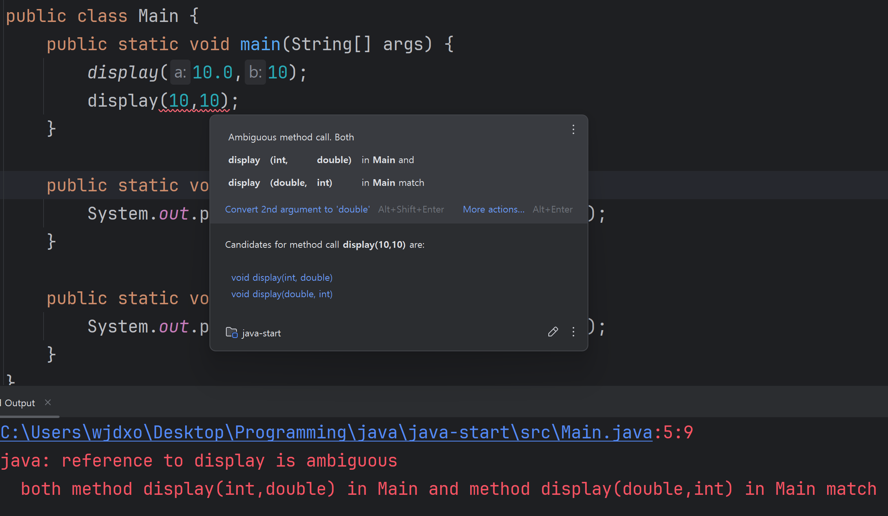
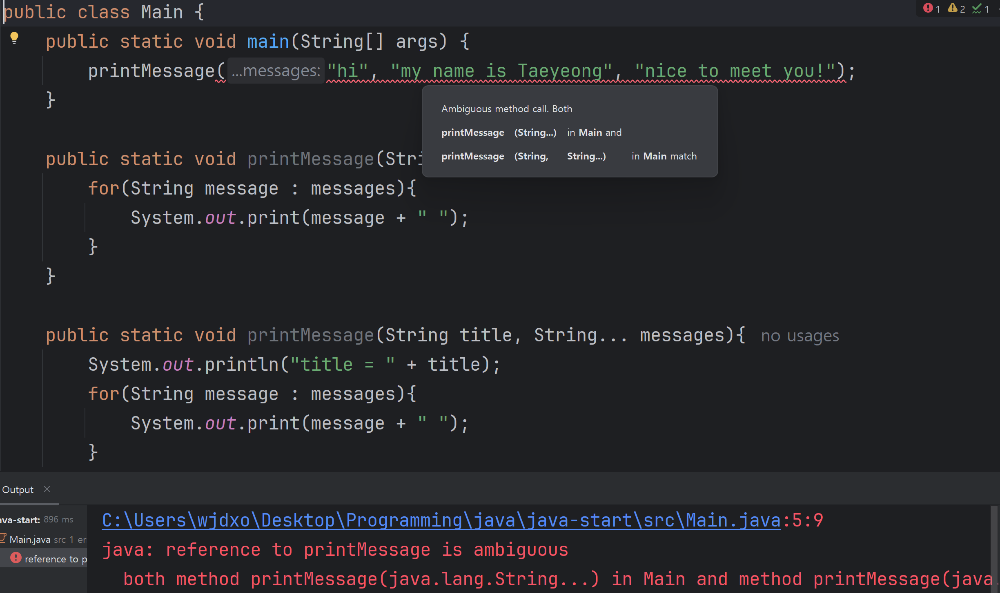

# 발표 내용 정리

# 모호한 호출 Ambiguous Call

어떤 메서드를 호출해야 할지 결정할 수 없는 상태

## 1. 자동 형변환 충돌

### 예시 상황

---

```java
public class Main {
    public static void main(String[] args) {
			  display(10.0, 10); // 호출1 -> 메서드2
        display(10, 10); // 호출2 -> 메서드1, 메서드2
    }
    
    public static void display(int a, double b){ // 메서드1
        System.out.println("int : " + a + " double : " + b);
    }

    public static void display(double a, int b){ // 메서드2
        System.out.println("double : " + a + " int : " + b);
    }
}
```

| 구분 | 인자 Argument | 호출 |
| --- | --- | --- |
| `display(10.0, 10);` | `double` , `int`  | 메서드2 |
| `display(10, 10);` | `int` , `int` | 메서드1,  메서드2 |
- `int`  → `double`  자동 형변환이 가능 ⇒ `display1`, `display2` 이론적으로 **둘 다 호출 가능**
- 모호한 호출 상황

### 결과

---



- 인텔리제이 → 모호한 호출 경고
- 실행 시 → 컴파일 에러

## 2. 가변 인자와 일반 인자 충돌

### 가변 인자

---

```java
// 가변 인자 메서드 정의
public void printNames(String... names) {
    for (String name : names) {
        System.out.println(name);
    }
}

// 호출 방식 (모두 가능)
printNames();                 // 0개
printNames("Java");           // 1개
printNames("C++", "Python");  // 여러 개
```

**특징**

- 호출하는 인자를 자유롭게**(0 ~ N개)** 넣을 수 있음
- 자동으로 **배열** 생성

**규칙**

- 가변 인자는 매개변수 중 **마지막에 위치**
- 메서드당 **최대 하나** 가능

### 예시 상황

---

```java
public class Main {
    public static void main(String[] args) {
        printMessage("hi", "my name is Taeyeong", "nice to meet you!");
    }

    public static void printMessage(String... messages){
        for(String message : messages){
            System.out.println(message);
        }
    }

    public static void printMessage(String title, String... messages){
        System.out.println("title = " + title);
        for(String message : messages){
            System.out.print(message);
        }
    }
}
```

- **시나리오 1**

```java
**hi**
my name is Taeyeong
nice to meet you!
```

- **시나리오 2**

```java
**title = hi**
my name is Taeyeong
nice to meet you!
```

### 결과

---

