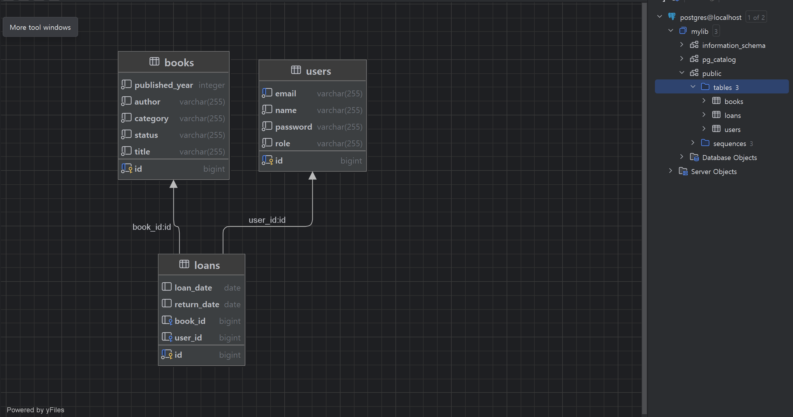

# 도메인 설명

## ERD 다이어그램

## 도메인 설명

### 도메인 요약 설명

| 컬럼명        | 타입            | 제약 조건  | 설명                               |
| ------------- | --------------- | ---------- | ---------------------------------- |
| id            | Long(자동 생성) | `PK`       | 책을 구분해주는 id                 |
| title         | 문자열          | `NOT NULL` | 제목                               |
| author        | 문자열          | `NOT NULL` | 저자                               |
| publishedYear | 정수            | `NOT NULL` | 발행연도                           |
| category      | 문자열          | `NOT NULL` | 분류                               |
| status        | enum            | `NOT NULL` | 현재 상태 → `대출 중`, `이용 가능` |

# API 명세

## API

| API                    | Body 양식           | 반환 값              | 동작                               |
| ---------------------- | ------------------- | -------------------- | ---------------------------------- |
| **POST /books/create** | `BookCreateRequest` | `Long`               | 책 생성 후 생성된 id 반환          |
| **GET /books**         | -                   | `List<BookResponse>` | DB에 있는 모든 책의 모든 정보 반환 |
| **PATCH /books/{id}**  | `BookUpdateRequest` | -                    | 책 내용 일부(제목) 변경            |
| **DELETE /books/{id}** | -                   | -                    | 책 DB에서 삭제                     |

## DTO

| DTO                   | 양식                                                           | 목적         |
| --------------------- | -------------------------------------------------------------- | ------------ |
| **BookCreateRequest** | `title`, `author`, `publishedYear`, `category`                 | 책 생성      |
| **BookResponse**      | `id`, `title`, `author`, `publishedYear`, `category`, `status` | 책 조회      |
| **BookUpdateRequest** | `title`                                                        | 책 제목 변경 |

# API 호출 결과

## API 호출 1 : 책 생성하기

## API 호출 2 : 책 전부 조회하기

## API 호출 3 : 책 제목 변경하기

## API 호출 4 : 책 삭제하기

# 회고

## 강의에서 배운 것 중 직접 활용한 것

- Controller - Service - Repository 구조
- JPA
- Entity

## DTO로 분리하는 이유

### 보안의 이유

- 응답할 때 엔티티 구조를 그대로 반환하면 → 테이블 구조, 민감한 정보 노출

### 시인성

- 요청 또는 응답 양식을 쉽게 확인할 수 있음

## 막혔던 부분

- 배우긴 배웠지만 어떻게 설계해야 할지 답답했다.
- Codex를 통해 현재 상태에서 뭘 해야할지 답을 얻을 수 있었고 중간중간 모르는 것에 대해서는 Gemini와 GPT를 활용하였다.

## 새롭게 활용해본 것

- 롬복
- PostgresQL
- 인텔리제이 Database
- 엔티티와 관련된 애노테이션
- Postman
- codex
