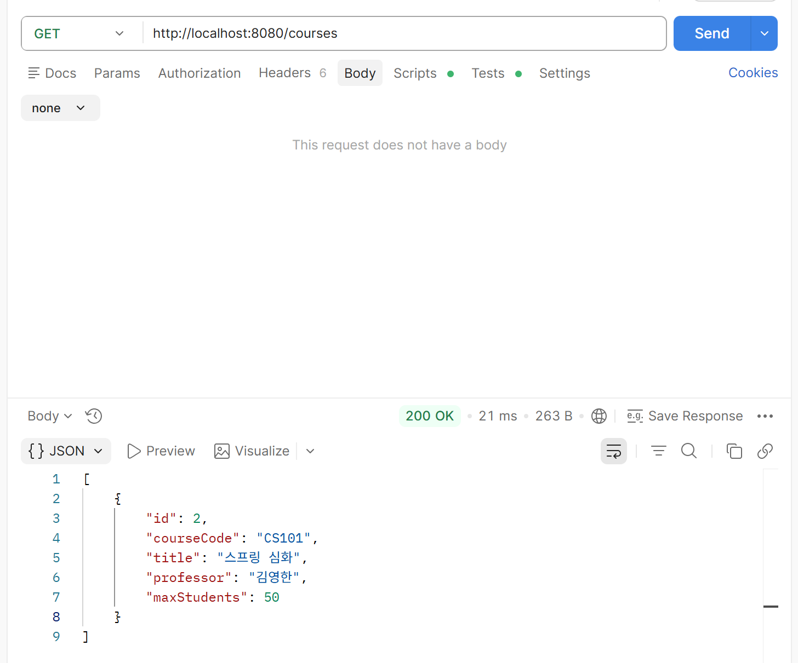
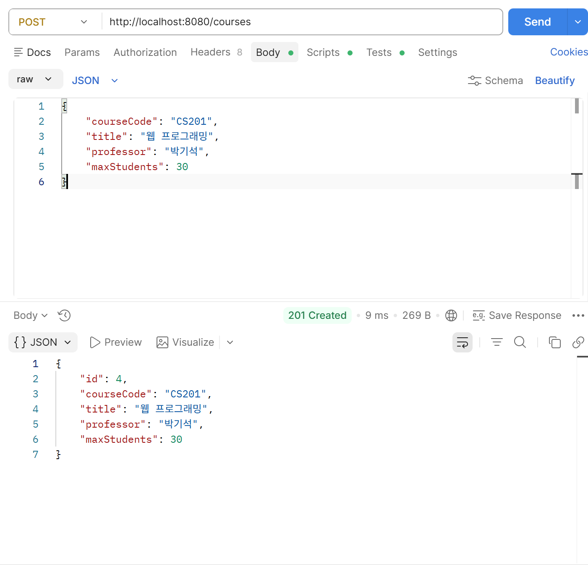
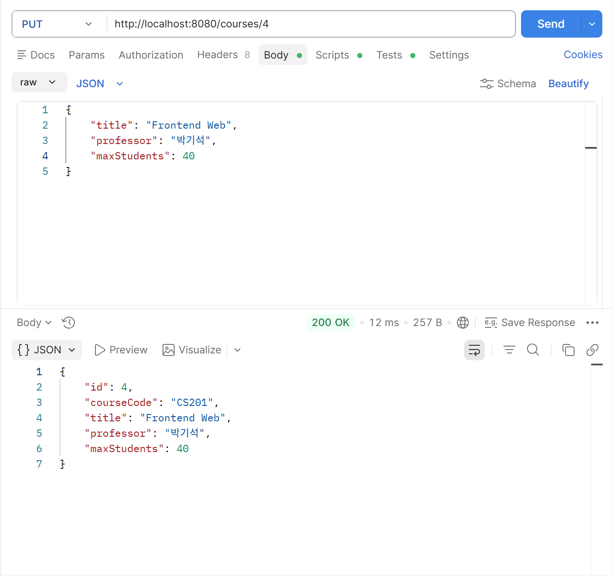
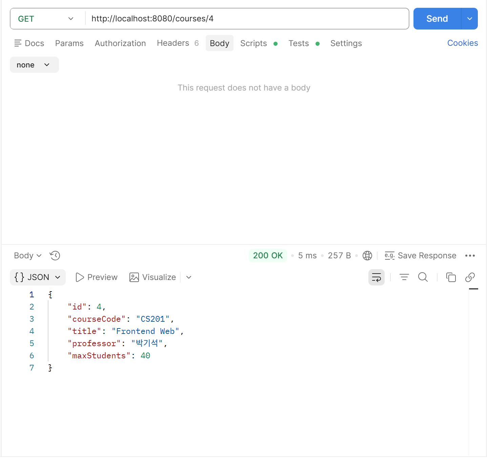
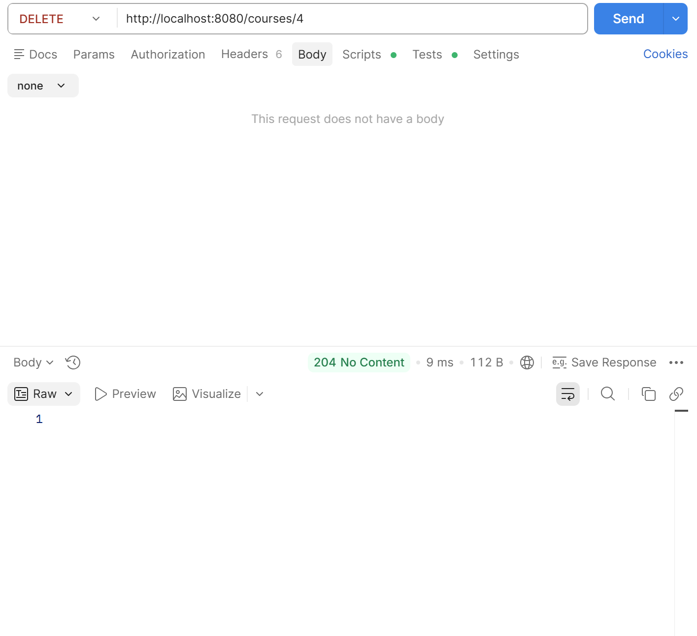

# Course Management API

## 도메인 설명
수업(Course)을 관리하는 백엔드 REST API입니다.

### Course 엔티티
| 필드 | 타입 | 설명 |
|------|------|------|
| id | Long | 기본키 (자동 생성) |
| courseCode | String | 수업 코드 (예: CS101) |
| title | String | 수업명 |
| professor | String | 담당 교수 |
| maxStudents | int | 최대 수강 인원 |


## API 명세

### 1. 수업 등록
| 항목 | 내용 |
|------|------|
| 메서드 | POST |
| URI | /courses |
| 상태 코드 | 201 Created |

**요청 DTO (CourseCreateRequest)**
```json
{
    "courseCode": "CS101",
    "title": "스프링 입문",
    "professor": "김영한",
    "maxStudents": 30
}
```

**응답 DTO (CourseResponse)**
```json
{
    "id": 1,
    "courseCode": "CS101",
    "title": "스프링 입문",
    "professor": "김영한",
    "maxStudents": 30
}
```

---

### 2. 전체 수업 조회
| 항목 | 내용 |
|------|------|
| 메서드 | GET |
| URI | /courses |
| 상태 코드 | 200 OK |

**응답 DTO (List\<CourseResponse\>)**
```json
[
    {
        "id": 1,
        "courseCode": "CS101",
        "title": "스프링 입문",
        "professor": "김영한",
        "maxStudents": 30
    }
]
```

---

### 3. 단건 수업 조회
| 항목 | 내용 |
|------|------|
| 메서드 | GET |
| URI | /courses/{id} |
| 상태 코드 | 200 OK |

**응답 DTO (CourseResponse)**
```json
{
    "id": 1,
    "courseCode": "CS101",
    "title": "스프링 입문",
    "professor": "김영한",
    "maxStudents": 30
}
```

---

### 4. 수업 수정
| 항목 | 내용 |
|------|------|
| 메서드 | PUT |
| URI | /courses/{id} |
| 상태 코드 | 200 OK |

**요청 DTO (CourseUpdateRequest)**
```json
{
    "title": "스프링 심화",
    "professor": "김영한",
    "maxStudents": 50
}
```

**응답 DTO (CourseResponse)**
```json
{
    "id": 1,
    "courseCode": "CS101",
    "title": "스프링 심화",
    "professor": "김영한",
    "maxStudents": 50
}
```

---

### 5. 수업 삭제
| 항목 | 내용 |
|------|------|
| 메서드 | DELETE |
| URI | /courses/{id} |
| 상태 코드 | 204 No Content |

---

## Postman 테스트 결과





---

## 회고

### 강의에서 배운 내용 중 직접 써본 것 3가지
1.JpaRepository 로 기본 CRUD 메서드 생성<br>
2.Mapping 애노테이션으로 API 매핑<br>
3.의존성 주입을 생성자 1개로 @Autowired 생략

### Controller에서 DTO를 분리한 이유
Controller에 Entity를 그대로 받고나 반환하는 경우, DB의 구조가 그대로 노출될 수 있기 때문에, DTO를 통해서 request와 response에 필요한 정보만을 담아서 http 통신을 하고, 로직은 서버에 숨겨 처리한다.

### 막혔던 부분과 해결 방법
#### 최초 시도 및 문제 상황
처음엔 요청 DTO에도 id 필드를 포함시켰다.
그리고 전체 조회와 단건 조회 API의 http 메서드가 모두 GET이고 엔드 포인트도 /courses였다
request body의 id 필드가 null 값인지 아닌지에 따라 호출하는 API를 다르게 하려고 했다<br>
코드가 복잡해지고 RESTAPI 원칙에도 적합하지 않았다.
#### 해결 방법
요청 DTO에 id 필드를 제외하고 URI에 id 값이 포함되어 있는지 유무에 따라 각 기능을 분리했다.